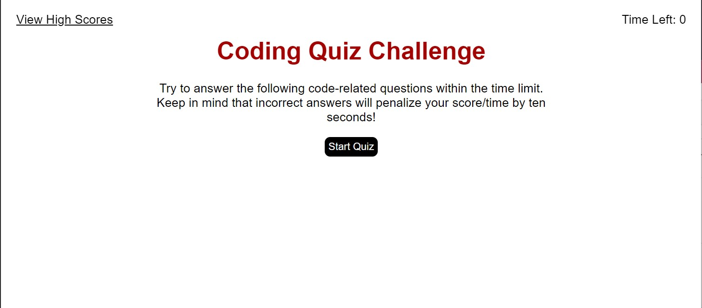

# Code Quiz

## Description

I was asked to create an on-line quiz containing questions pertaining to JavaScript. Many times, these types of quizzes are an important part of the interview process for developers. Employers often use these types of quizzes to help them select job candidates with the knowledge and experience that they are seeking.

## Usage

Once you have navigated to the code quiz page you will be presented with an introductory page with instructions. Once you click on the "Start Quiz" button, the first question will appear. After you select and answer, the next question will appear, and so on. Once the timer has ended or you have answered all the questions, the quiz will end. You will be given an opportunity to enter your initials and your score will be saved.

https://jaschmidt22.github.io/code-quiz/
## Credits

Throughout the making of this project, I frequently referenced my class repository ASU-VIRT-FSF-PT-10-2023-U-LOLC. I also referenced Google, W3Schools, MDN Webdocs, and ChatGPT.

## License

MIT License

Copyright (c) [2023] [jaschmidt22]

Permission is hereby granted, free of charge, to any person obtaining a copy of this software and associated documentation files (the "Software"), to deal in the Software without restriction, including without limitation the rights to use, copy, modify, merge, publish, distribute, sublicense, and/or sell copies of the Software, and to permit persons to whom the Software is furnished to do so, subject to the following conditions:

The above copyright notice and this permission notice shall be included in all copies or substantial portions of the Software.

THE SOFTWARE IS PROVIDED "AS IS", WITHOUT WARRANTY OF ANY KIND, EXPRESS OR IMPLIED, INCLUDING BUT NOT LIMITED TO THE WARRANTIES OF MERCHANTABILITY, FITNESS FOR A PARTICULAR PURPOSE AND NONINFRINGEMENT. IN NO EVENT SHALL THE AUTHORS OR COPYRIGHT HOLDERS BE LIABLE FOR ANY CLAIM, DAMAGES OR OTHER LIABILITY, WHETHER IN AN ACTION OF CONTRACT, TORT OR OTHERWISE, ARISING FROM, OUT OF OR IN CONNECTION WITH THE SOFTWARE OR THE USE OR OTHER DEALINGS IN THE SOFTWARE.
